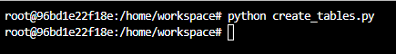
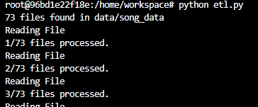
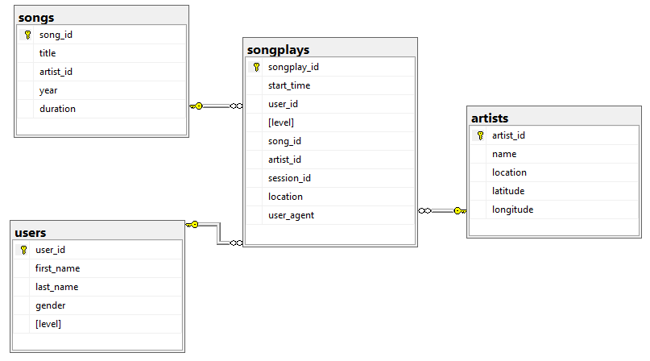
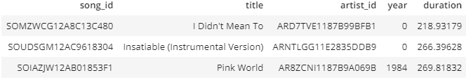
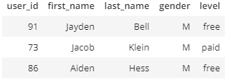
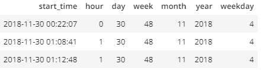
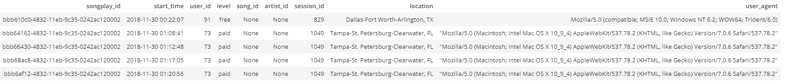
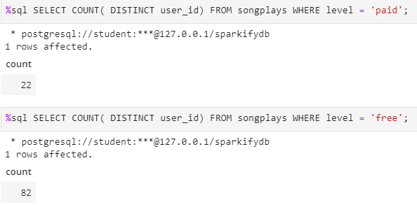
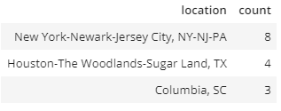
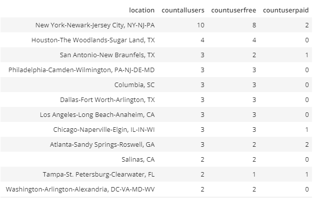

# Sparkify 
Sparkify is a music streaming platform created by Udacity.

## Introduction

Sparkify wants to analyze the data they've been collecting on songs and user activity on their new music streaming app. The analytics team is particularly interested in understanding what songs users are listening to. 

Currently, they don't have an easy way to query their data, which resides in a directory of JSON logs on user activity on the app, as well as a directory with JSON metadata on the songs in their app.

## Getting Started

### Prerequisites

- Python 3.6.3
- psycopg2
- pandas
- uuid

### Installing
-  pip install psycopg2
-  conda install pandas

## Project 
### Purpose

The purpose of this project:

- Create an OLAP database with star schema.
- Create fact and dimension tables to store the raw data and to run analytical querys later on. 
- Create an ETL pipline to read raw JSON data and insert it into an OLAP Database. 

### Project Sturcutre

- data folder: includes the JSON files
- images folder: includes images used in readme file
- create_tables.py: will create the database and the tables. (Objects will be dropped if they already exists.)
- etl.ipynb: used to import data into tables. 
- etl.py: is the pipline. It will import all json files into the tables. 
- readme.md: Readme file.
- sql_queries.py: 
    - Defines all SQL DDL (data definition language) queries to create and drop database objects. 
    - Defines all SQL DML (data manipulation language ) queries to select from and insert into tables. 
- test.ipynb: used to run query on the Tables, to test if the data has been inserted or not.

### Run project
To run the project you need create the Database and tables needed to store the data. After that the ETL programm can be started.

- Create database and tables

<code>
    python create_tables.py
</code>

- Run ETL 

<code>
    python etl.py
</code>

### Database 

The JSON Data will be read and saved in a Postgres database with tables designed to optimize queries on song play analysis. The Database will be designed using Star schema. 
This design will help Sparkify run analytical queries and fetch important information about the entities by joining the songplays table with one or more dimension tables. (See examples below)

### Raw Data

The data is saved in JSON format. There are two types, one for song metadata and the other for log. 

- Song metadata
<code>
    {
        "num_songs": 1,
        "artist_id": "ARD7TVE1187B99BFB1",
        "artist_latitude": null,
        "artist_longitude": null,
        "artist_location": "California - LA",
        "artist_name": "Casual",
        "song_id": "SOMZWCG12A8C13C480",
        "title": "I Didn't Mean To",
        "duration": 218.93179,
        "year": 0
    }
</code>

- Log data
<code>
{
	"artist": null,
	"auth": "Logged In",
	"firstName": "Theodore",
	"gender": "M",
	"itemInSession": 0,
	"lastName": "Smith",
	"length": null,
	"level": "free",
	"location": "Houston-The Woodlands-Sugar Land, TX",
	"method": "GET",
	"page": "Home",
	"registration": 1540306145796.0,
	"sessionId": 154,
	"song": null,
	"status": 200,
	"ts": 1541290555796,
	"userAgent": "Mozilla/5.0 (Windows NT 6.1; WOW64; rv:31.0) Gecko/20100101 Firefox/31.0",
	"userId": "52"
}
</code>

### Design 
For this database a Star schema is used, which provides query performance qains and fast aggregations, which will be helpful for Sparkify team to run fast aggregation query on the entites and get usefull information

**Dimensions Tables:**
- **Songs**

- **Artists**

 
- **Users**

- **Time**

**Fact Tables:**
- **Songplays**

### ETL Pipeline

- The ETL pipline will read the metadata files and extract song and artist data and insert only new data into the dimension tables. 
- It wil also extract user data from the log file, drop the duplicat data, and fill user tables with data. 
- Log data will be inserted into songplays.
- Timestamp columns in log file will be converted to populate Time table with data. (Timestamp, month, week, day, hour, minute)

### Examples
- **How many free and paid user are there**

 <code>
    SELECT COUNT( DISTINCT user_id) FROM songplays WHERE level = 'free'; 
    SELECT COUNT( DISTINCT user_id) FROM songplays WHERE level = 'paid';
</code>
 

- **Where are the most free user from**

    <code>
        SELECT location, COUNT( DISTINCT user_id) FROM songplays WHERE level = 'free' GROUP BY location ORDER BY 2 DESC LIMIT 3;    
    </code>

- **Comparision between free and paid users**

    <code>
        SELECT location
        , COUNT( DISTINCT user_id) AS CountAllUsers
        , COUNT(DISTINCT CASE WHEN level = 'free' THEN user_id ELSE NULL END ) AS CountUserFree
        , COUNT(DISTINCT CASE WHEN level = 'paid' THEN user_id ELSE NULL END ) AS CountUserPaid 
        FROM songplays 
        GROUP BY location 
        ORDER BY CountAllUsers DESC ;
    </code>
    

- **Top 3 Songs**

    <code>
        SELECT songs.title
            ,  COUNT(songplays.artist_id)  AS CountSong
        FROM songplays 
        JOIN songs 
            ON songplays.song_id = songs.song_id 
        GROUP BY songplays.song_id, songs.title 
        ORDER BY CountSong DESC LIMIT 3; 
    </code>

- **Top 3 Artists**

     <code>
        SELECT artists.name
            ,  COUNT(songplays.artist_id) AS CountArtist
        FROM songplays 
        JOIN artists 
            ON songplays.artist_id = artists.artist_id 
        GROUP BY songplays.artist_id, artists.name 
    ORDER BY CountArtist DESC LIMIT 3; 
    </code>    
